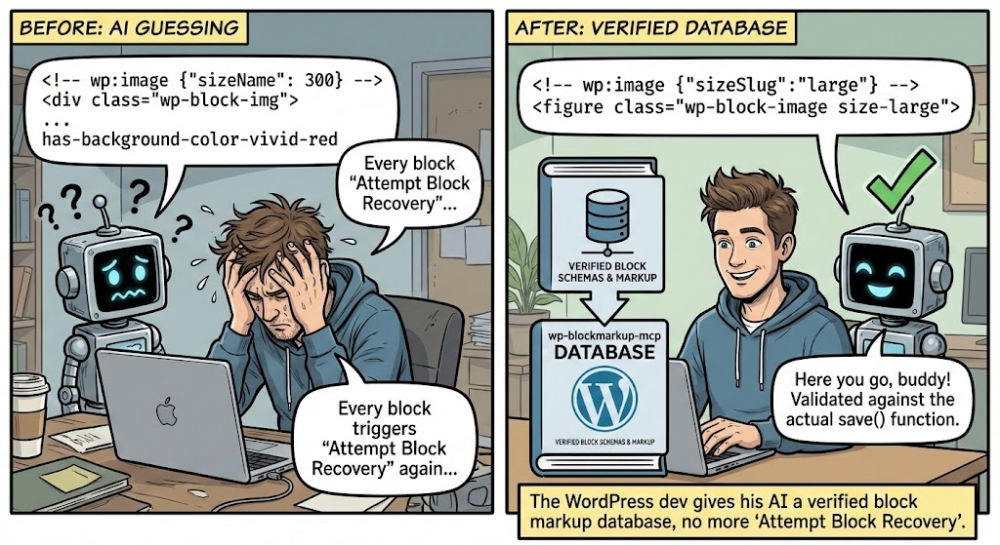

# wp-blockmarkup-mcp

<p align="center">
  
</p>

**Give your AI assistant a verified block markup database instead of letting it guess Gutenberg HTML.**

wp-blockmarkup-mcp is a local [MCP server](https://modelcontextprotocol.io/) that extracts, validates, and indexes every Gutenberg block from WordPress core, WooCommerce, or any block-based plugin you work with. It gives AI tools like Claude Code a verified database of block schemas, attributes, and validated markup examples to query — instead of relying on training data that hallucinates block structures, invents attributes, and produces markup that triggers "Attempt Block Recovery" in the editor.

**Current validation results:** 121 core Gutenberg blocks indexed — 100% of static block markup examples pass both structural and save-function validation.

## Why This Exists

AI assistants are increasingly used to generate WordPress content programmatically — building pages via the REST API, migrating content between platforms, populating headless frontends. But every AI model shares the same blind spot: **block markup comes from training data, not from the actual block source code**.

This means:

- **Models invent attributes that don't exist** — `fontSize` as a number when it expects a string slug like `"large"`
- **Class naming patterns are wrong** — `has-background-color-vivid-red` instead of `has-vivid-red-background-color`
- **Block nesting rules are ignored** — putting blocks inside containers that don't support `InnerBlocks`
- **Dynamic blocks get static markup** — generating HTML for blocks that only accept comment delimiters with attributes
- **Third-party blocks are invisible** — WooCommerce blocks, Kadence blocks, ACF blocks are all unknown to training data
- **Subtle mismatches break silently** — the markup looks right but the editor flags it as invalid, requiring manual recovery

You only discover these problems when content lands in the editor and every block shows a yellow warning bar. In an agentic workflow where the AI generates and pushes content autonomously, bad markup means broken pages.

## The Solution

**Feed the AI real block data.** Instead of hoping the model remembers the right markup format, give it a verified database to query and validate against.

wp-blockmarkup-mcp parses the actual source code of any block-based plugin, extracts every block's schema, and **validates generated markup through a two-tier pipeline** — first using the official WordPress block parser for structural correctness, then verifying HTML output patterns against the block's `save()` function AST. Your AI assistant queries this database before generating content, and can validate its output before pushing it.

This fits naturally into content generation workflows. When Claude Code (or any MCP-compatible assistant) needs to generate Gutenberg block markup, it:

1. **Searches** the indexed database for relevant blocks
2. **Retrieves** the full attribute schema and validated markup examples
3. **Generates** content using verified patterns
4. **Validates** the generated markup against the block's actual save function before pushing it

No "Attempt Block Recovery". No broken pages. No guessing.

**What gets indexed:**

| Data | Details |
|------|---------|
| Block metadata | Name, title, description, category, API version |
| Attributes | Full schema with types, defaults, sources, selectors, allowed values |
| Support configs | Alignment, color, typography, spacing, border, layout, dimensions |
| Variations | Pre-configured block variations with attributes and markup |
| Save patterns | HTML wrapper elements, class naming patterns, style patterns, InnerBlocks usage |
| UI controls | Inspector controls, toolbar controls, attribute mappings |
| Validated markup | Examples validated against the block's own `save()` function |

**What the AI gets for each block:**

- Full attribute table with types, defaults, and constraints
- Support configuration (which features the block enables)
- Validated markup examples for different feature combinations (basic, with colors, with typography, with spacing, full-featured)
- Block type classification (static / dynamic / hybrid)
- Validation status (`verified` / `structural_only` / `attributes_only`)
- Variations with pre-configured attributes and markup

## Quick Start

```bash
# Clone and install
git clone https://github.com/pluginslab/wp-blockmarkup-mcp.git
cd wp-blockmarkup-mcp
npm install
```

### Index Your First Source

Each `source:add` command clones the repo and indexes it automatically:

```bash
# WordPress Gutenberg core blocks (121 blocks)
npx wp-blocks source:add \
  --name gutenberg \
  --type github-public \
  --repo https://github.com/WordPress/gutenberg \
  --branch trunk
```

That's it. 121 core blocks extracted, validated, and indexed — 60 static blocks fully verified, 61 dynamic blocks with validated attributes.

### Connect to Claude Code

Add the MCP server to your Claude Code configuration. Create or edit `.mcp.json` in your project root:

```json
{
  "mcpServers": {
    "wp-blockmarkup": {
      "command": "npx",
      "args": ["--prefix", "/absolute/path/to/wp-blockmarkup-mcp", "wp-blockmarkup-mcp"]
    }
  }
}
```

Now when you ask Claude Code to generate WordPress content with Gutenberg blocks, it will automatically search block schemas and validate markup against your indexed sources.

## Indexing Sources

### Gutenberg Core Blocks

```bash
npx wp-blocks source:add \
  --name gutenberg \
  --type github-public \
  --repo https://github.com/WordPress/gutenberg \
  --branch trunk
```

### WooCommerce Blocks

```bash
npx wp-blocks source:add \
  --name woocommerce-blocks \
  --type github-public \
  --repo https://github.com/woocommerce/woocommerce \
  --subfolder plugins/woocommerce-blocks \
  --branch trunk
```

### Any Public Block Plugin

```bash
# Example: Kadence Blocks
npx wp-blocks source:add \
  --name kadence-blocks \
  --type github-public \
  --repo https://github.com/stellarwp/kadence-blocks

# Example: GenerateBlocks
npx wp-blocks source:add \
  --name generateblocks \
  --type github-public \
  --repo https://github.com/suspended-developer/generateblocks
```

### Your Private Plugins

For private GitHub repos, store your token in an environment variable (never in the config):

```bash
export GITHUB_TOKEN=ghp_xxxxxxxxxxxx

npx wp-blocks source:add \
  --name my-custom-blocks \
  --type github-private \
  --repo https://github.com/yourorg/your-blocks \
  --token-env GITHUB_TOKEN
```

### Local Block Development

Point directly at a folder on your machine — great for blocks you're actively developing:

```bash
npx wp-blocks source:add \
  --name my-local-blocks \
  --type local-folder \
  --path /path/to/wp-content/plugins/my-blocks
```

### Source Options

| Option | Description |
|--------|-------------|
| `--name` | Unique name for this source (required) |
| `--type` | `github-public`, `github-private`, or `local-folder` (required) |
| `--repo` | GitHub repository URL |
| `--subfolder` | Only index a subfolder within the repo |
| `--branch` | Git branch (default: `main` — use `trunk` for WordPress/Gutenberg repos) |
| `--token-env` | Environment variable name holding a GitHub token (private repos) |
| `--path` | Local folder path |
| `--no-index` | Register the source without indexing it yet |

## CLI Reference

```
npx wp-blocks source:add           Add a source and index it
npx wp-blocks source:list          List all sources with indexed status
npx wp-blocks source:remove <name> Remove a source and all its data
npx wp-blocks index                Re-index all sources (or --source <name>)
npx wp-blocks search <query>       Full-text search across blocks
npx wp-blocks schema <block-name>  Show full schema for a block
npx wp-blocks validate <markup>    Validate block markup structurally
npx wp-blocks stats                Show block counts and validation coverage per source
npx wp-blocks rebuild-index        Rebuild full-text search indexes
```

### CLI Examples

```bash
# Search for image-related blocks
npx wp-blocks search "image gallery"

# Search only blocks from a specific source
npx wp-blocks search "product" --source woocommerce-blocks

# Filter by block type
npx wp-blocks search "posts" --type dynamic

# Get full schema for a specific block
npx wp-blocks schema core/paragraph

# Validate block markup (use a file or quoted string)
npx wp-blocks validate "$(cat my-block.html)"

# Re-index a specific source after updates
npx wp-blocks index --source gutenberg

# Force full re-index (ignore content hash cache)
npx wp-blocks index --force

# See what you have indexed
npx wp-blocks stats
```

## MCP Tools

When connected to Claude Code (or any MCP-compatible client), six tools are available:

### `search_blocks`

Full-text search with BM25 ranking across all indexed blocks. Search by name, title, description, or category. Supports filters for source, category, and block type (static/dynamic).

### `get_block_schema`

Returns the complete schema for a block: full attribute table with types and defaults, support configurations, variations, validation status, and block type. This is how the AI understands what a block accepts before generating markup.

### `get_block_markup`

Returns markup examples for a block with their validation status, optionally filtered by features used (color, typography, spacing, alignment). Filter to `validated_only: true` to get only examples that passed both structural and save-function validation. Every `verified` example has been validated through both tiers of the pipeline.

### `validate_markup`

Accepts raw block markup and validates it using the official WordPress block parser (`@wordpress/block-serialization-default-parser`) — the same parser that runs inside WordPress itself:
- **Structural** — parses comment delimiters exactly like WordPress does, validates JSON attributes
- **Schema** — checks attribute names exist in the block's schema, verifies value types and enum constraints
- **Block resolution** — confirms the block name exists in indexed sources, identifies dynamic vs. static blocks

Returns `VALID`, `INVALID` with specific errors, or `VALID (attributes only)` for dynamic blocks.

### `list_block_attributes`

Returns all attributes for a block with their types, defaults, allowed values, sources, and selectors. Useful when the AI needs to construct specific attribute combinations.

### `search_variations`

Searches block variations by name or description. Returns matching variations with their pre-configured attributes and validated markup.

## How It Works

### Extraction Pipeline

1. **Sources** are registered via the CLI — each points to a GitHub repo or local folder
2. **Block discovery** scans for `block.json` files recursively throughout the source
3. **Parsing** runs four analyzers per block:
   - `block-json-parser` — metadata, attributes, supports, context
   - `edit-parser` — Babel AST analysis for UI controls and attribute mappings
   - `save-parser` — Babel AST analysis for HTML output patterns, class names, styles
   - `variations-parser` — pre-configured block variations
4. **Classification** determines block type:
   - **Static** — has `save()` returning JSX (full validation possible)
   - **Dynamic** — `save()` returns null, rendered by PHP (attribute validation only)
   - **Hybrid** — has both `save()` JSX and `render.php`
5. **Markup generation** creates examples for each block with different feature combinations (basic, alignment, color, typography, spacing, full-featured)
6. **Validation** runs the two-tier pipeline on each generated example and stores the result

### Validation Pipeline

Every generated markup example goes through a tiered validation pipeline during indexing. The validation status is stored per-example and rolled up to the block level.

**Tier 1 — Structural validation (all blocks)**

Uses `@wordpress/block-serialization-default-parser` — the exact same parser that runs inside WordPress:
- Parses comment delimiters using WordPress's own tokenizer regex
- Extracts block name, attributes JSON, and innerHTML
- Validates attribute names exist in the block's schema (plus global attributes like `className`, `anchor`, `style`, `backgroundColor`, `textColor`, `fontSize`, `align`)
- Type-checks attribute values against the schema (`string`, `number`, `boolean`, `array`, `object`)
- Validates enum constraints where the schema defines allowed values
- Recursively validates nested inner blocks

**Tier 2 — Save function pattern matching (static/hybrid blocks only)**

Uses AST analysis of the block's `save()` function to verify the generated HTML matches expected patterns:
- **Wrapper element** — confirms the HTML uses the correct root element (`<p>`, `<div>`, `<figure>`, etc.) matching what `save()` returns
- **CSS class structure** — verifies `wp-block-*` classes, color classes (`has-{slug}-background-color`, `has-text-color`, `has-background`), font-size classes (`has-{slug}-font-size`), alignment classes
- **Style attributes** — checks that spacing/typography attributes in the comment are reflected in the HTML `style` attribute (padding, margin, line-height)
- **InnerBlocks** — validates that `InnerBlocks.Content` usage in `save()` is consistent with nested block presence

This approach validates the output patterns without requiring the full WordPress block editor runtime, making it fast and dependency-light.

**Dynamic blocks**

Dynamic blocks (`save()` returns null) skip Tier 2:
- Validates the comment delimiter + attributes via Tier 1
- Stores the self-closing format: `<!-- wp:namespace/block-name {"attrs":"here"} /-->`
- Marks as `validation_status: 'attributes_only'` — WordPress accepts this format via REST API and renders the HTML server-side via PHP

**Validation statuses:**

| Status | Meaning |
|--------|---------|
| `verified` | Passed both Tier 1 (structural) and Tier 2 (save patterns) |
| `structural_only` | Passed Tier 1 but Tier 2 found HTML pattern issues |
| `attributes_only` | Dynamic block — only comment delimiter and attributes validated |
| `invalid` | Failed Tier 1 structural validation |

The **confidence score** (0–100%) reflects extraction quality from the source code. The **validation status** reflects markup correctness. A block is marked `verified` at the block level when all its markup examples pass both tiers.

### Incremental Updates

- `git pull` on cached repos (or re-read local folders)
- Content hash per block directory — skip unchanged blocks
- Re-extract and re-validate only changed blocks
- Soft-delete blocks whose `block.json` was removed

### Data Storage

All data lives in `~/.wp-blockmarkup-mcp/`:

```
~/.wp-blockmarkup-mcp/
  blocks.db           # SQLite database (FTS5, WAL mode)
  cache/              # Cloned repositories
```

### Database Schema

```sql
sources         — registered repos/folders with indexing metadata
blocks          — block metadata, type, validation status, confidence
attributes      — per-block attributes with types, defaults, constraints
supports        — per-block feature support configurations
markup_examples — validated markup examples with features used
variations      — block variations with attributes and markup
blocks_fts      — FTS5 full-text search index
```

## Dynamic Blocks

Dynamic blocks (Latest Posts, Search, Categories, etc.) have their `save()` function return `null` — the HTML output is rendered server-side by PHP based on the current data and theme.

For these blocks, wp-blockmarkup-mcp:
- Extracts the full attribute schema from `block.json`
- Validates attribute types and constraints
- Stores the **comment-only self-closing markup format**: `<!-- wp:latest-posts {"postsToShow":5} /-->`
- Marks them as `validation_status: 'attributes_only'`

This format is valid and accepted by the WordPress REST API. WordPress will render the visual HTML server-side when the post is displayed. The AI can use this markup to insert dynamic blocks with correct attributes — the visual output just depends on the server environment.

## Companion Tool: wp-devdocs-mcp

This project is part of the [PluginsLab](https://github.com/pluginslab) ecosystem alongside [wp-devdocs-mcp](https://github.com/pluginslab/wp-devdocs-mcp), which indexes WordPress hooks, filters, and JS APIs for AI-assisted **code** development.

Together they cover both sides of WordPress AI assistance:
- **wp-devdocs-mcp** — verified hooks for writing plugin/theme **code**
- **wp-blockmarkup-mcp** — verified block schemas for generating **content**

Same source registration workflow. Same MCP integration. Complementary tools for the same AI assistant.

## Theme-Aware Content Generation

wp-blockmarkup-mcp knows **how to write blocks correctly** — schemas, attributes, markup format, validation. What it deliberately does not know is **what design tokens your theme provides** — colors, font sizes, spacing scales, gradients. Those come from `theme.json` and are different for every site.

This is by design. Indexing themes alongside block schemas would mix site-specific data with universal block knowledge, producing suggestions with colors and fonts that don't exist in your theme.

### How it works in practice

The intended workflow pairs this MCP server with a WordPress site MCP that knows your active theme. The LLM sits on top and orchestrates both:

```
You: "Build a hero section with our brand colors, a heading, and a CTA to /pricing"

LLM thinks:
  1. Ask WordPress MCP → what colors does the active theme provide?
     → learns: "primary" (#1a1a2e), "accent" (#e94560), font sizes sm/md/lg/xl
  2. Ask wp-blockmarkup-mcp → search_blocks("cover"), get_block_schema("core/cover")
     → learns: dimRatio, contentAlign, overlayColor attributes and correct markup format
  3. Ask wp-blockmarkup-mcp → get_block_schema("core/buttons")
     → learns: button block structure and nesting rules
  4. Combine both → generates markup using "primary" slug (from theme)
     with correct attribute names (from block schema)
  5. Ask wp-blockmarkup-mcp → validate_markup(generated)
     → confirms it's structurally correct
```

### MCP configuration

Both servers are registered in your MCP client config. For Claude Code (`.mcp.json`):

```json
{
  "mcpServers": {
    "wp-blockmarkup": {
      "command": "npx",
      "args": ["--prefix", "/path/to/wp-blockmarkup-mcp", "wp-blockmarkup-mcp"]
    },
    "wordpress": {
      "command": "wordpress-mcp",
      "args": ["--url", "https://yoursite.com"]
    }
  }
}
```

The LLM sees all tools from both servers and can reason about when to use each. To make the workflow explicit, add a `CLAUDE.md` to your project:

```markdown
## WordPress Content Generation

When generating Gutenberg block markup:
1. Use `wordpress.get_theme_settings` to get the active color palette,
   font sizes, and spacing scale from theme.json
2. Use `wp-blockmarkup.search_blocks` to find correct block names
3. Use `wp-blockmarkup.get_block_schema` to verify attribute names and types
4. Use theme-specific slugs (from step 1) for colors — not default palette values
5. Use `wp-blockmarkup.validate_markup` before outputting final markup
```

### What the validator accepts

The validation pipeline is already slug-agnostic. It checks that the JSON attributes and HTML classes **agree with each other** — not that color slugs come from a specific palette. If your markup says `backgroundColor: "primary"`, the validator checks that `has-primary-background-color` and `has-background` appear in the HTML classes. It doesn't care whether `"primary"` comes from WordPress defaults or your custom theme.

This means markup generated with theme-specific tokens validates correctly without this tool needing any theme awareness.

## Requirements

- Node.js 20+
- ~500MB disk space per large plugin source (Gutenberg, WooCommerce)

## License

MIT
